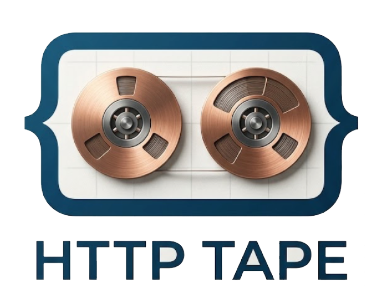

<p align="center">
  
</p>

<h3 align="center">record, redact, replay</h3>

<p align="center">
  HTTP traffic recording, sanitization, and replay for Go.<br>
  <strong>Embeddable library · CLI · Docker · Testcontainers</strong>
</p>

<p align="center">
  <a href="https://pkg.go.dev/github.com/VibeWarden/httptape"></a>
  <a href="LICENSE"></a>
  <a href="https://hub.docker.com/r/tibtof/httptape"></a>
</p>

---

httptape captures HTTP request/response pairs, sanitizes sensitive data on write,
and replays them as a mock server. Think WireMock, but native Go, 6 MB Docker image,
and with sanitization built into the core.

## Why httptape?

- **WireMock requires Java** — separate process, 200 MB+ memory, can't embed in a Go binary
- **Go mocking libraries** (`gock`, `httpmock`) only work inside test code — no standalone server, no recording, no fixture management
- **json-server / Mockoon** — no recording, no sanitization, manual fixture writing only
- **Nobody does sanitization** — existing tools record raw traffic including secrets and PII. httptape sanitizes on write — sensitive data never hits disk

## Use cases

### Integration testing
Record real API interactions once, replay forever. Deterministic CI without live API credentials.

```go
store := httptape.NewMemoryStore()
rec := httptape.NewRecorder(store, httptape.WithSanitizer(sanitizer))
defer rec.Close()

client := &http.Client{Transport: rec}
// ... hit real APIs, fixtures are recorded and sanitized ...

srv := httptape.NewServer(store)
ts := httptest.NewServer(srv)
// ... replay against ts.URL in your tests ...
```

### Frontend-first development
Use httptape as a mock backend while building your UI — no real backend needed.

```bash
# Hand-write fixtures or record from a staging API
httptape record --upstream https://staging-api.example.com \
    --fixtures ./mocks --config sanitize.json

# Serve as a mock backend for your frontend
httptape serve --fixtures ./mocks --port 3001
```

Your frontend on `localhost:3000` hits httptape on `localhost:3001`. Edit JSON fixture files, and the next request picks up the changes — instant hot-reload.

### Production traffic capture
Record a sample of live traffic, safely redacted:

```bash
docker run -v ./fixtures:/fixtures -v ./config.json:/config/config.json \
    tibtof/httptape record \
    --upstream https://api.internal:8080 \
    --fixtures /fixtures --config /config/config.json
```

Sensitive data (secrets, PII) is redacted before it touches disk. Export sanitized fixtures for dev/CI use.

## Install

**Go library:**
```bash
go get github.com/VibeWarden/httptape
```

**CLI:**
```bash
go install github.com/VibeWarden/httptape/cmd/httptape@latest
```

**Docker** (6 MB, multi-arch):
```bash
docker pull tibtof/httptape
```

## Quick start

### Record

```go
store := httptape.NewMemoryStore()
rec := httptape.NewRecorder(store, httptape.WithRoute("github-api"))
defer rec.Close()

client := &http.Client{Transport: rec}
resp, err := client.Get("https://api.github.com/users/octocat")
// Tape is automatically saved to store
```

### Sanitize

Redact secrets and fake PII — on write, before anything hits disk:

```go
sanitizer := httptape.NewPipeline(
    httptape.RedactHeaders("Authorization", "Cookie"),
    httptape.RedactBodyPaths("$.card.number", "$.ssn"),
    httptape.FakeFields("my-seed", "$.email", "$.user_id"),
)
rec := httptape.NewRecorder(store, httptape.WithSanitizer(sanitizer))
```

Or declaratively via JSON config:

```json
{
  "version": "1",
  "rules": [
    {"action": "redact_headers", "headers": ["Authorization", "Cookie"]},
    {"action": "redact_body", "paths": ["$.card.number", "$.ssn"]},
    {"action": "fake", "seed": "my-seed", "paths": ["$.email", "$.user_id"]}
  ]
}
```

### Replay

```go
srv := httptape.NewServer(store)
ts := httptest.NewServer(srv)
defer ts.Close()

resp, err := http.Get(ts.URL + "/users/octocat")
```

### Match

Composable matching with weighted scoring:

```go
srv := httptape.NewServer(store,
    httptape.WithMatcher(httptape.NewCompositeMatcher(
        httptape.MatchMethod(),      // score: 1
        httptape.MatchPath(),        // score: 2
        httptape.MatchHeaders("Accept", "application/json"), // score: 3
        httptape.MatchQueryParams(), // score: 4
        httptape.MatchBodyHash(),    // score: 8
    )),
)
```

### Store

```go
// In-memory (for tests)
mem := httptape.NewMemoryStore()

// Filesystem (for fixtures)
fs := httptape.NewFileStore(httptape.WithDirectory("./testdata/fixtures"))
```

### Import / Export

```go
// Export sanitized fixtures as a portable bundle
r, _ := httptape.ExportBundle(ctx, store,
    httptape.WithRoutes("stripe-api"),
    httptape.WithSince(time.Now().Add(-24*time.Hour)),
)

// Import on another machine
httptape.ImportBundle(ctx, store, r)
```

## CLI

```bash
httptape serve   --fixtures ./mocks --port 8081
httptape record  --upstream https://api.example.com --fixtures ./mocks --config sanitize.json
httptape export  --fixtures ./mocks --output bundle.tar.gz
httptape import  --fixtures ./mocks --input bundle.tar.gz
```

## Docker

```bash
# Replay mode
docker run -v ./mocks:/fixtures -p 8081:8081 tibtof/httptape serve --fixtures /fixtures

# Record mode (with sanitization)
docker run -v ./mocks:/fixtures -v ./config.json:/config/config.json -p 8081:8081 \
    tibtof/httptape record --upstream https://api.example.com \
    --fixtures /fixtures --config /config/config.json
```

Also available on GHCR: `ghcr.io/vibewarden/httptape`

## Testcontainers

```go
import httptapetest "github.com/VibeWarden/httptape/testcontainers"

container, err := httptapetest.RunContainer(ctx,
    httptapetest.WithFixturesDir("./testdata/fixtures"),
)
defer container.Terminate(ctx)

// container.BaseURL() returns the mock server URL
resp, _ := http.Get(container.BaseURL() + "/api/users")
```

## How it compares

| Feature | httptape | WireMock | json-server | MSW | gock |
|---|---|---|---|---|---|
| Embeddable in Go | **yes** | no (Java) | no (Node) | no (browser) | yes |
| Standalone server | **yes** | yes | yes | no | no |
| Docker | **6 MB** | 200 MB+ | 50 MB+ | n/a | n/a |
| Recording | **yes** | yes | no | no | no |
| Sanitization on write | **yes** | no | no | no | no |
| Deterministic faking | **yes** | no | no | no | no |
| Frontend mock backend | **yes** | yes | yes | yes (browser) | no |
| Fixture import/export | **yes** | partial | no | no | no |
| Dependencies | **zero** | JVM | npm | npm | 1 |

## Key design decisions

| Decision | Choice | Reason |
|---|---|---|
| Dependencies | stdlib only | Zero transitive deps for embedders |
| Sanitization | On write | Sensitive data never touches disk |
| Faking | HMAC-SHA256 | Deterministic — same input always produces the same fake |
| Fixtures | JSON | Human-readable, easy to inspect and edit |
| Storage | Pluggable | `MemoryStore` for tests, `FileStore` for persistence |
| Recording | Async by default | Non-blocking, minimal hot-path overhead |
| Matching | Composable | Start simple, add specificity as needed |

## Documentation

- [Getting Started](docs/getting-started.md)
- [Recording](docs/recording.md) · [Replay](docs/replay.md) · [Sanitization](docs/sanitization.md)
- [Matching](docs/matching.md) · [Storage](docs/storage.md) · [Import/Export](docs/import-export.md)
- [JSON Config](docs/config.md) · [CLI Reference](docs/cli.md)
- [Docker](docs/docker.md) · [Testcontainers](docs/testcontainers.md)
- [API Reference](docs/api-reference.md)

## License

[Apache 2.0](LICENSE)
